# MCOC2020-P3

## CONDICIONES DE BORDE NATURALES AL CASO 1-D:

Para obtener la condición de borde natural en el lado izquierdo, se aplico la siguiente condición de borde:

Aproximando la condición de borde por medio de sus diferencias finitas de primer orden para el tiempo constante, fijándonos en el puesto 0 y comparándolo con el puesto 1:

Al reordenar la ecuación:

De esta forma obtenemos un nuevo stencil de diferencias finitas (pequeño) que nos permite completar el valor faltante.

Después de agregar la línea anterior al código y usando los mismos parámetros de los ejemplos de clases. Para el caso de la siguiente imagen: 

 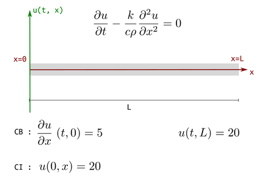

Se realizo el gráfico con un paso de integración dt = 2s y curvas de evolución térmica cada 1000 pasos hasta llegar a 50000 pasos. Los resultados se presentan a continuación:

 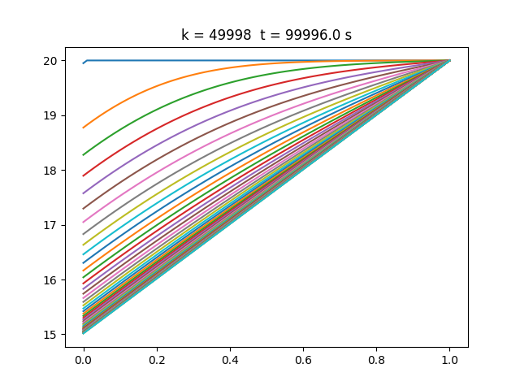

Al analizar el gráfico se puede ver como al final la solución converge ya que las últimas curvas son rectas prácticamente estables.

Las condiciones de borde natural de el tipo estudiado hasta ahora, pueden ser utilizadas cuando se tiene continuidad de piezas de hormigón, es decir cando se tiene una pieza con ciertas temperaturas adyacente a otra con temperaturas distintas. De esta forma se evitará tener un salto en las temperaturas ya que las tangentes coincidirán.  

## CASOS 2-D PARA VERIFICAR:

Las condiciones de borde para el caso 2D son de la forma:

u_k[:,:] = TEMPERATURA INICIAL EN TODAS PARTES

u_k[0,:] = TEMPERATURA IZQUIERDA

u_k[-1,:] =  TEMPERATURA DERECHA

u_k[:,0] =  TEMPERATURA INFERIOR

u_k[:,-1] = TEMPERTURA SUPERIOR

u_k[0,:] = u_k[1,:] - (GRADIENTE T IZQUIERA) * dx

u_k[-1,:] = u_k[-2,:] - (GRADIENTE T DERECHA) * dx

u_k[:,0] = u_k[:,1] - (GRADIENTE T INFERIOR) * dy

u_k[:,-1] = u_k[:,-2] - (GRADIENTE T SUPERIOR) * dy

Dependiendo de lo especificado para cada caso se asignaron valores a las variables anteriores o en caso de no tener valor, las variables se eliminaron.

**CASO 1:**

Condiciones de borde:

    20° Inicial
    
    Borde Superior: 0°
    
    Borde Izquierdo: 20°
    
    Borde Inferior: 20°
    
    Borde Derecho: 0°
    
Entonces:

    u_k[:,:] = 20.     # 20 grados inicial en todas partes
    
    u_k[:,-1] = 0.  #Sup.
    
    u_k[0,:] = 20.  #Izq.
    
    u_k[:,0] = 20.  #Inf.
    
    u_k[-1,:] = 0   #Der.
    
Se eliminaron las filar respectivas a los gradientes.

El grafico de temperaturas para estas condiciones de borde en los puntos

* P1 (𝑎/2,𝑏/2)

* P2 (𝑎/2,3𝑏/4)

* P3 (3𝑎/4,3𝑏/4)

 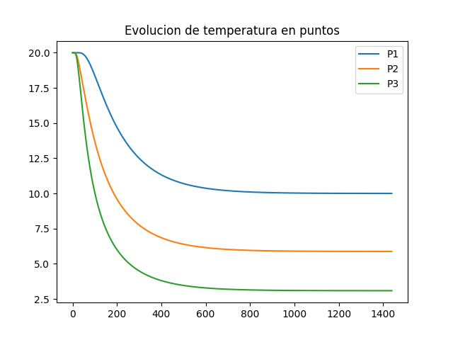

El gif animado con toda la evolución de temperatura para el caso 1 se presenta a continuación:

 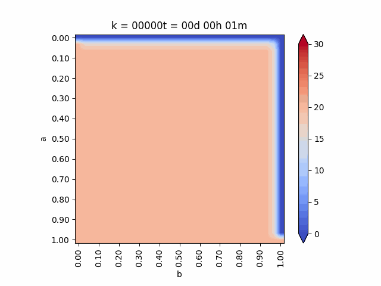

**CASO 2:**

Condiciones de borde:

    20° Inicial
    
    Borde Superior: 0°
    
    Borde Izquierdo: 20°
    
    Borde Inferior: 20°
    
    Borde Derecho: Gradiente 0

Entonces:

    u_k[:,:] = 20.     # 20 grados inicial en todas partes
    
    u_k[:,-1] = 0.  #Sup.
    
    u_k[0,:] = 20.  #Izq.
    
    u_k[:,0] = 20.  #Inf.
    
    u_k[-1,:] = u_k[-2,:] - 10*dx # Der. gradiente - 10

Se eliminaron las filar respectivas al gradiente superior, izquierdo e inferior y al lado derecho.

El grafico de temperaturas para estas condiciones de borde en los puntos

* P1 (𝑎/2,𝑏/2)

* P2 (𝑎/2,3𝑏/4)

* P3 (3𝑎/4,3𝑏/4)

 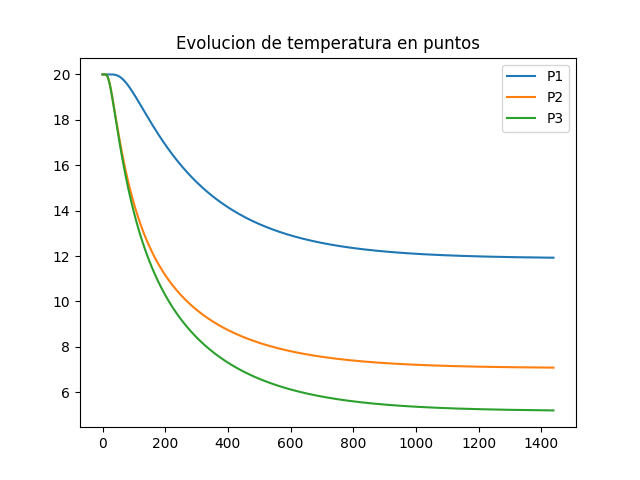
 
 El gif animado con toda la evolución de temperatura para el caso 2 se presenta a continuación:

 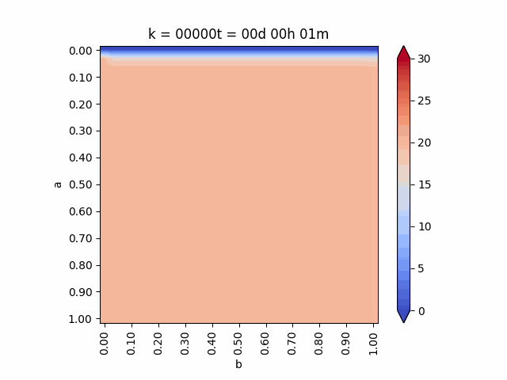

**CASO 3:**

Condiciones de borde:

    10° Inicial
    
    Borde Superior: 0°
    
    Borde Izquierdo: 20°
    
    Borde Inferior: 20°
    
    Borde Derecho: 20°

Entonces:

    u_k[:,:] = 10.     # 10 grados inicial en todas partes
    
    u_k[:,-1] = 0.  #Sup.
    
    u_k[0,:] = 20.  #Izq.
    
    u_k[:,0] = 20.  #Inf.
    
    u_k[-1,:] = 20   #Der.

Se eliminaron las filar respectivas a los gradientes.

El grafico de temperaturas para estas condiciones de borde en los puntos

* P1 (𝑎/2,𝑏/2)

* P2 (𝑎/2,3𝑏/4)

* P3 (3𝑎/4,3𝑏/4)

 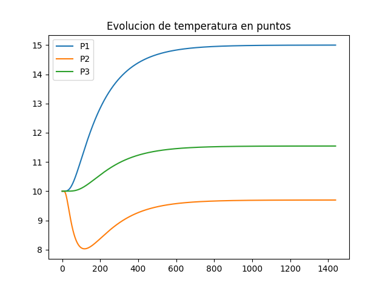
 
 El gif animado con toda la evolución de temperatura para el caso 3 se presenta a continuación:

 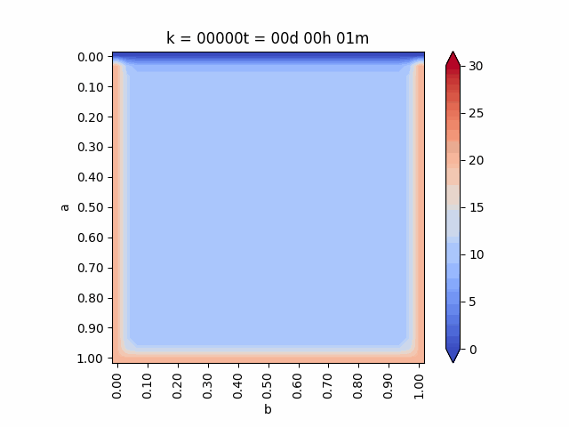

**CASO 4:**

El caso 4, a diferencia de los anteriores, también cambia de dimensiones. En el eje x tiene un largo de 0.5 metros, es por esto que en la línea 7 del código hay que fijar la variable b = 0.5. Así mismo hay que realizar un cambio en la primera línea de la función imshowbien la línea debe ser:
    
    imshow(u.T[Ny::-1,:],cmap=cm.coolwarm,interpolation='bilinear')

Condiciones de borde:

    10° Inicial
    
    Borde Superior: 0°
    
    Borde Izquierdo: 20°
    
    Borde Inferior: 20°
    
    Borde Derecho: Gradiente 0

Entonces:

    u_k[:,:] = 10.     # 10 grados inicial en todas partes
    
    u_k[:,-1] = 0.  #Sup.
    
    u_k[0,:] = 20.  #Izq.
    
    u_k[:,0] = 20.  #Inf.

    u_k[-1,:] = u_k[-2,:] - 0*dx # Der. gradiente 0

Se eliminaron las filar respectivas al gradiente superior, izquierdo e inferior y al lado derecho.

El grafico de temperaturas para estas condiciones de borde en los puntos

* P1 (𝑎/2,𝑏/2)

* P2 (𝑎/2,3𝑏/4)

* P3 (3𝑎/4,3𝑏/4)

 
 
 El gif animado con toda la evolución de temperatura para el caso 4 se presenta a continuación:

 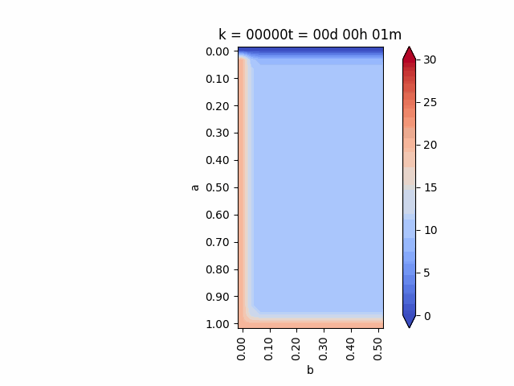
 
**CASO 5:**

Condiciones de borde:

    5° Inicial
    
    Borde Superior: Gradiente 0
    
    Borde Izquierdo: 25°
    
    Borde Inferior: Gradiente 0
    
    Borde Derecho: 25°

Entonces:
    
    u_k[:,:] = 5.     # 5 grados inicial en todas partes
    
    u_k[:,-1] = u_k[:,-2] - 0*dy # Sup. gradiente 0
    
    u_k[0,:] = 25.  #Izq.
    
    u_k[:,0] = u_k[:,1] - 0*dy # Inf. gradiente 0
    
    u_k[-1,:] = 25. #Der.

Se eliminaron las filar respectivas a al gradiente derecho e izquierdo, así como también el lado superior e inferior.

El grafico de temperaturas para estas condiciones de borde en los puntos

* P1 (𝑎/2,𝑏/2)

* P2 (𝑎/2,3𝑏/4)

* P3 (3𝑎/4,3𝑏/4)

 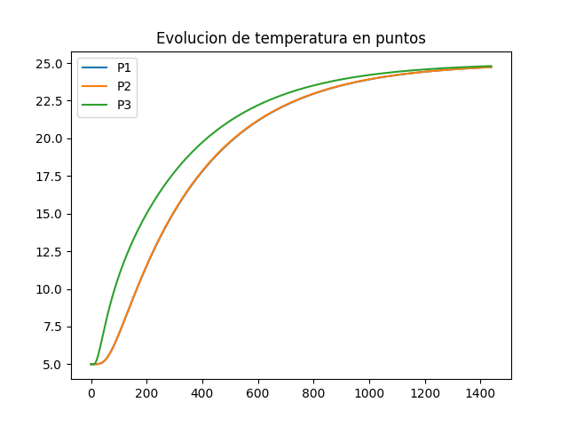
 
 El gif animado con toda la evolución de temperatura para el caso 5 se presenta a continuación:

 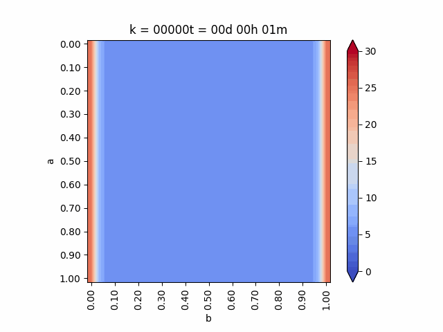

**CASO 6:**

Condiciones de borde:

    30° Inicial
    
    Borde Superior: Gradiente 0
    
    Borde Izquierdo: 10°
    
    Borde Inferior: Gradiente 0
    
    Borde Derecho: Gradiente 0

Entonces:

    u_k[:,:] = 30.     # 30 grados inicial en todas partes
    
    u_k[:,-1] = u_k[:,-2] - 0*dy # Sup. gradiente 0    
    
    u_k[0,:] = 10.  #Izq.

    u_k[:,0] = u_k[:,1] - 0*dy # Inf. gradiente 0
    
    u_k[-1,:] = u_k[-2,:] - 0*dx # Der. gradiente 0

En este caso se eliminaron todas las filas respectivas a las temperaturas de los lados menos la izquierda y solo se elimina la fila respectiva a al gradiente izquierdo.

El grafico de temperaturas para estas conciciones de borde en los puntos

* P1 (𝑎/2,𝑏/2)

* P2 (𝑎/2,3𝑏/4)

* P3 (3𝑎/4,3𝑏/4)

 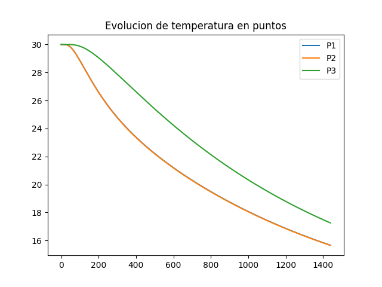
 
 El gif animado con toda la evolución de temperatura para el caso 5 se presenta a continuación:

 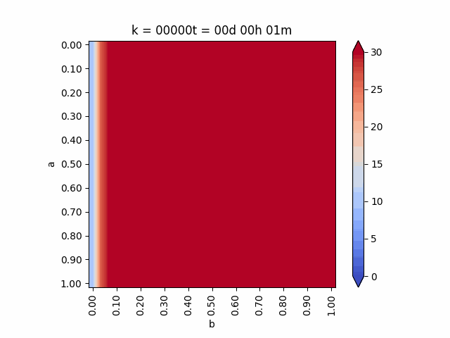
 
**CASO 7:**

Para el caso 7 se debe agregar las líneas número 107 y 125 que son idénticas:

    u_ambiente = 20. + 10*sin((2*pi/T)*t)

Condiciones de borde:

    20° Inicial
    
    Borde Superior: Temperatura ambiental (sinusoide con variación de 10°, período de 1 día)
    
    Borde Izquierdo: Gradiente 0
    
    Borde Inferior: Gradiente 0
    
    Borde Derecho: Gradiente 0

Entonces:

    u_ambiente = 20. + 10*sin((2*pi/T)*t)
    
    u_k[:,-1] = u_ambiente  #Sup.

    u_k[0,:] = u_k[1,:] - 0*dx # Izq. gradiente 0
    
    u_k[:,0] = u_k[:,1] - 0*dy # Inf. gradiente 0
    
    u_k[-1,:] = u_k[-2,:] - 0*dx # Der. gradiente 0

Como en el caso 7 solo tiene gradiente de temperatura para el borde superior e inferior, se eliminaron las filar respectivas a al gradiente derecho e izquierdo y todas las temperaturas a excepción de la superior.

El grafico de temperaturas para estas condiciones de borde en los puntos

* P1 (𝑎/2,𝑏/2)

* P2 (𝑎/2,3𝑏/4)

* P3 (3𝑎/4,3𝑏/4)

 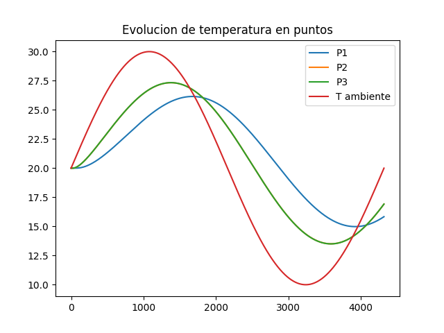
 
 El gif animado con toda la evolución de temperatura para el caso 7 se presenta a continuación:

 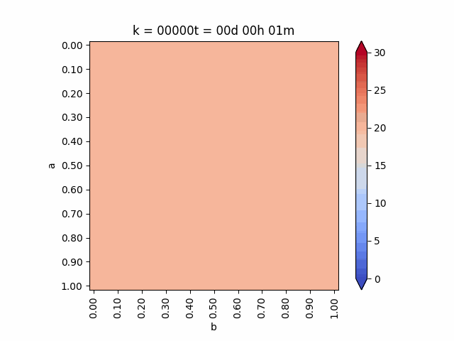
 
 
## CAMBIO AL CASO 3-D:

Para realizarelcambio a tres dimensiones es necesario tener 2 variables más para las condiciones de borde "normales" y dos valiables más para las condiciones de borde derivadas

Es facil darse cuenta de esto ya que al pasar de 1-D a 2-D se tuvieron que aumentar las variables para el borde inferior y el borde superior, ahora al pasar a 3-D se tendrán que agragar las variable para la profundidad. Se aumentarán las variables para el borde cercano (cara cercana) y para el borde profundo (cara profunda).

Las condiciones se seguirán imponiendo de la misma forma que lo hemos hecho hasta ahora.
